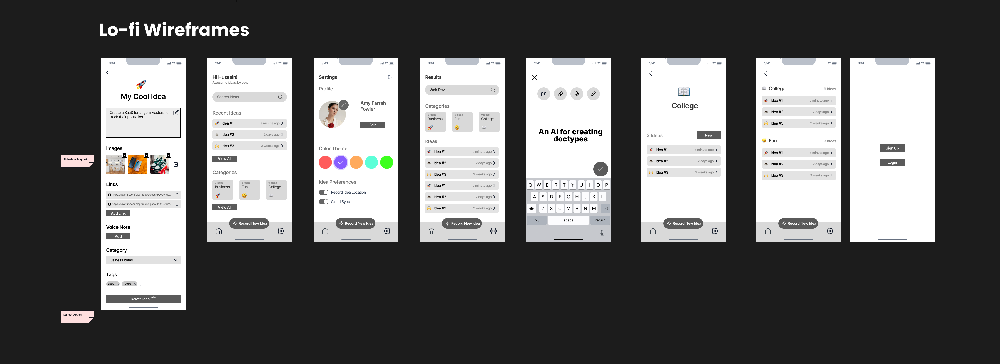
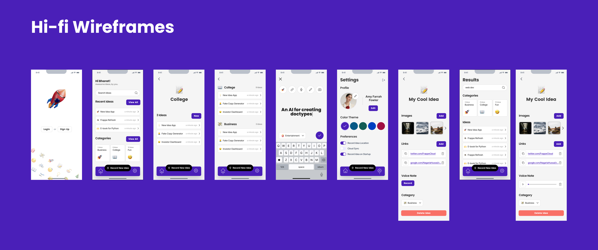
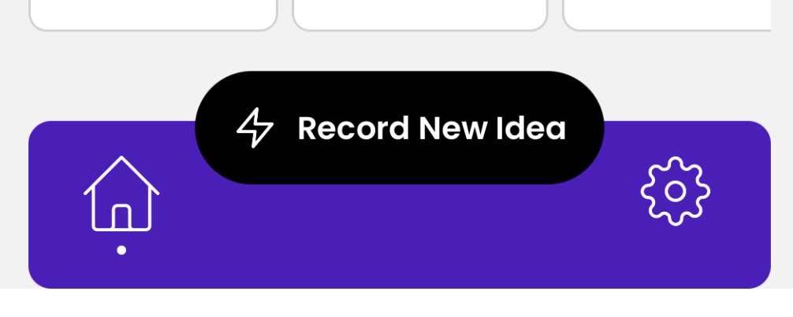
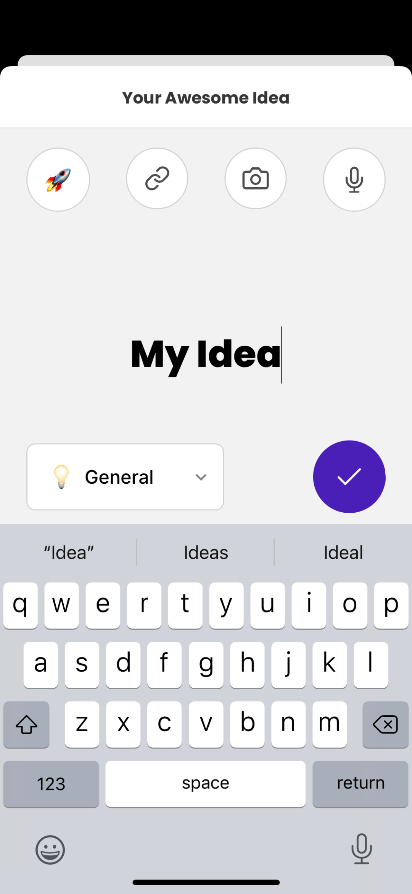
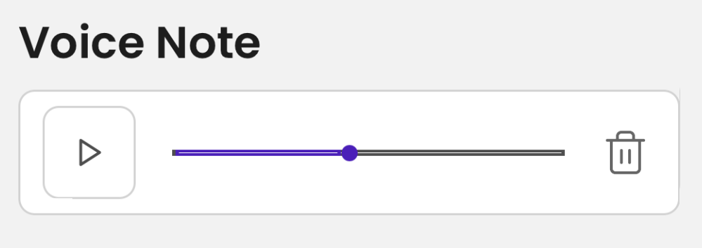
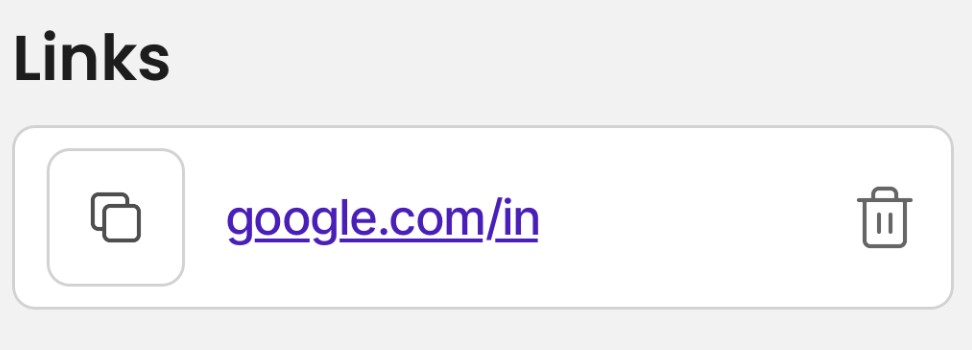

## Introduction

Introducing the **Idea Wallet** app. Built with React Native (expo).This Mobile App for writing and storing your ideas.
This report covers my approach and experience in designing and building this product from scratch and end-to-end. 

## Features

✅ Offline data storage

✅ Emoji Picker

✅ Custom Bottom Bar

✅ Animated Floating Actions

✅ Audio Player with progress

✅ Voice recorder

✅ Use of Clipboard API

✅ Nested Navigation using React Navigation

✅ Custom Fonts

✅ Image Picker & View

✅ Styled components with Theming


## Running the app locally

```
git clone https://github.com/Bharat-kasera/Idea.git
cd idea-wallet
yarn # install dependencies
npx expo start
```

[iOS Recommended] Either use the QR code to run the app on your phone (using Expo Go app) Or press `i` to launch the app on iOS simulator (assuming if you have that installed)

## Ideation

First of all, thank you for making it an open-ended project! This made it a very interesting project to work on. I started by asking my colleagues for suggestions. I got some pretty good ideas from them. Here are a few of them:

* A Better ToDo list application

* A Better weather application

* An app to help people decide what to cook today intelligently

* An app / platform to connect volunteers with elderly to help them with chores

But either the ideas seemed very general or huge in scope. Last month, while reading this amazing book titled "Creative Confidence" by the **Kelly** brothers, I came across this idea of keeping an idea wallet. Basically, the authors suggest to always have something (like a diary or a "whiteboard in the shower" 😂) to note down ideas, since ideas can strike you anywhere, anytime.

So, then I thought, why not create an "Idea Wallet" in the form of an app!

### The Problems

The core problems I am trying to solve with this app:

* Ideas getting lost before we can write them down or act on them

* The written record itself gets lost

* The written pieces are not always in hand

* Categorize the ideas

Idea Wallet app tries to solve the above mentioned problems along with providing features that are not possible with written records:

* Voice Notes

* Accessible storing of links

* Image / Screenshot attachments

### The Users

Me! I designed and built this app so that I can use it as my idea wallet. Eventually, I want to publish it to the app stores (both iOS and Android) for anyone to download and use.

## Design

Everything related to the design and prototype of the app can be found in this Figma file: <https://www.figma.com/design/uwmFLuPDPkF98hsrw8JGjU/Idea-Wallet?node-id=1-5585&t=DwYAxTZH5iAzseCa-1>. Basically, the product design cycle consisted of the below 4 phases/deliverables:

1. User Flow Diagram
2. Lo-Fi Wireframes (Grayscale / Made in Figma)
3. Hi-Fi Wireframes / Visual Design (Make it beautiful!)

Believe me, I have spent as much time, if not more, in designing the app as it took me to develop it to the current point. But having every screen designed and ready, accelerated the development speed.

### User Flow Diagram

Here, I have mapped almost all the core actions that I want the user to be able to do in the app. For instance, creating a new idea, deleting a idea, searching for an idea and more.


## Lo-fi Wireframes

I placed my hand sketches into the figma file and started to create a lo-fi wireframe corresponding to them one by one. This phase was all about deciding what element would go where. In this phase, I didn't worry about fonts, colors, spacing etc. Those were done in the visual design phase.



### Hi-fi Wireframes / Visual Design



This is my favorite part of the Product Design process. In my opinion, it is all about iteration, iteration and iteration! I created a mood board with all kinds of app design inspiration from all over Dribble.

This phase involved choosing colors, fonts, sizes etc. This is what makes the app look polished and visually pleasing.

### The Core Figma Components

I have extensively used Figma's component feature to create reusable components that are used through out the app screen designs. This also helped a lot while developing the app, as I started by directly building these components as React components which, though initially a slow process, paid of a lot at later stages.


## Development

### The Project Structure


All the source code files (except the main `App.js` file) are located in the `src` folder and nested in appropriate subdirectories. Except the `src/infra` folder, other folders are pretty self-explanatory. The core **infra**structure of the app has two parts:

1. theme
1. navigation

Both of these will be explained in detail in the coming sections.

### Styled Components: A different approach to styling

In the course, we were taught how to style the components by passing `StyleSheet` objects as props (the `style` named prop). But I came across a very interesting approach to styling components: [styled components](https://styled-components.com/). This library lets us write CSS-in-JS! As a web developer, I am very accustomed in writing CSS, so this immediately felt more intuitive and better. Behind the scenes, it converts the CSS we write into stylesheet objects and passes it as props.

Here is a simple example showing the difference between the two approaches:

* Before `styled-components`

```js
import { View, StyleSheet } from "react-native";


export const MyComponent = () => {
  return (
    <View style={styles.container}>
    </View>
  );
};

const styles = StyleSheet.create({
  container: {
    flex: 1,
    backgroundColor: "white",
    alignItems: "center",
    justifyContent: "center",
  },
});
```

* After `styled-components`

```js
import styled from "styled-components";

const Container = styled.View`
    flex: 1;
    background-color: white;
    align-items: center;
    justify-content: center;
`

export const MyComponent = () => {
  return <Container />;
};
```

I find this more readable and succinct than using JS objects to store style key-value pairs.

### Theme-ing with styled components

It is now time to talk about the `infra/theme` part. This directory basically stores all the "design tokens" for building the app. This directory has four files:

1. `index.js`: Basically exports a `theme` object with contents from the other three folders.
2. `colors.js`: Stores and exports the colors (primary, stroke, typography colors, etc.)
3. `fonts.js`: Stores and exports the font tokens: font family, font sizes and font weights.
4. `sizes.js`: Presently it only stores sizes for border radius.

We then provide this `theme` object (exported from `infra/theme/index.js`) to the `ThemeProvider` (this too comes from the `styled-components` library) rendered in the `App.js` file.

One of the biggest benefits of styled-components is this! Once you have wrapped your root component with the `ThemeProvider`, you can access your design tokens anywhere down the component tree. You can get access to your theme object inside styled components like this:

```js
const PageTitle = styled.Text`
  color: ${({ theme }) => theme.colors.typography.pageTitle};
  font-family: ${({ theme }) => theme.fonts.pageHeading};
  font-size: ${({ theme }) => theme.fontSizes.lg};
  font-weight: ${({ theme }) => theme.fontWeights.extraBold};
  text-align: left;
`;
```

Biggest benefit of using theme object values: you need to change a value (for instance, your primary color) only at one place and it gets reflected on all parts of your app where that particular design token was used.

One can also access the theme context in any react component by using the `useTheme` hook provided:

```js
import { useTheme } from "styled-components";
// ...
    {
        const theme = useTheme();
        const primaryColor = theme.colors.primary.main;
        // ...
    }
```

Isn't the `styled-components` approach too awesome?!

### Where is the data stored?

All the data is stored locally on the user's phone. This is made possible by the `@react-native-async-storage/async-storage` package. Check out the `src/lib/storage.js` for all the utility function related managing data on the phone storage.

The data is initially loaded by the `IdeaProvider` (`src/provider/idea.js`) and it is available in all the screens of the `HomeNavigator`

### Entry Points: App.js

This is exactly what is returned by the `App` component:

```js
<ThemeProvider theme={theme}>
    <AuthProvider>
        <SafeAreaView style={{ flex: 1 }}>
            <Navigation />
        </SafeAreaView>
    </AuthProvider>
    <AlertMessage position="top" />
</ThemeProvider>
```

There are two main providers: `ThemeProvider` (which comes from `styled-components`) and `AuthProvider` (which I have implemented to provide authentication state for Supabase Auth). As you can see, a `Navigation` component is rendered at root. The Navigation component then manages all the screens using React Navigation, as discussed more in the next section.

### Navigation

The entry point for Navigation is located at `src/infra/navigation/index.js`. Basically it is a wrapper around React Navigation's `NavigationContainer` and renders either the `HomeNavigator` or `AuthNavigator` based on the authentication status. Currently, the authentication is useless, so I am just rendering the home navigator.

There is a lot of nesting of Navigators (Stack, Tab etc.) going on here, a diagram will give us a much better idea:


As you see in the diagram, to achieve the desired navigation flow, I have used many advanced features provided by React Navigation like nested navigators support, Tab Navigator, Stack Navigator, Navigation groups, Modal pages (which slide in from bottom and can be swiped down to close, like the New Idea Input Screen). Now, let's talk about that lit bottom tab bar!

### Bottom Tab Bar

I spent a whole day on this one 😅. While designing I didn't knew it would be a "little" hard to implement, but it turned out to be fun and awesome!



It is always present on the screen, except for the modal screens like new idea and category input. This is a standalone React component that I created, code can be found at `src/components/BottomNavigationBar.js`.

## Some cool components

I will not be able to cover each and every component in this report, since there are a lot (a lot!) of them. I tried to refactor and extract reusable components as much as possible. None the less, here are some of the "complex" components that I find cool and which were fun and non-trial to implement.

### The Emoji Picker

This is one of my favorite components. It uses the below 3 libraries to work:

1. `gemoji`: List of emojis (with descriptions) used by GitHub.
1. `react-native-popover-view`: For shown the popover
1. `@shopify/flash-list`: For rendering the list of emojis to the popover view.


I had to use `flash-list` because the normal scroll view/flat list were rendering very slow given the large number of emojis (~2000) and I wanted to make it snappy!

### The `FloatingActions` component: Animated, Reanimated

They float above the keyboard when it is opened. Used in New Idea Input Screen, New Category Screen and Link Attachment screens. Better seen on video demo.



We were taught about animations using `Animated` from react native. I came across this advanced (and popular) animation library for react native called `Reanimated`. I have used Reanimated to **animate the floating actions container** based on the visibility of the keyboard. It is a spring-y animation.

Based on: <https://snack.expo.dev/@andypandy/animated-button-above-keyboard?platform=ios>

### The Voice Note player

I designed and developed a voice note / sound player component basically from scratch. It takes a sound URI and offers play/pause controls along with a progress bar!



### Category Select Dropdown

This component is used to select a category for an idea:


This uses `react-native-element-dropdown` component as a starting point.

### The Link Attachment / Click to Copy



The user can click on the copy button on the left side to **copy the link to the clipboard**. I was not able to implement the delete functionality before deadline.

## The Backend

I did setup a [supabase](https://supabase.com) backend and integrated idea wallet for authenticating. But then I decided to **build an offline-first app**. So, no authentication is required until the user wants to sync their ideas to the cloud, a feature I plan to implement in the second version of this app.

## What went sideways?

The Scope. I spent so much time designing the app and aiming for a lot of features. But, I was not able to implement all of it before the deadline. Here are the things that I was not able to implement while submission:

1. Settings Screen (themes)
2. Update an existing idea and its attachments
3. Sync to Cloud
4. Search Feature

## Further Improvement

I plan to continue working on this app even after submitting this assignment. Here are a few thing that can be improved / introduced in the idea wallet app before publishing it to the app stores:

* Customized Splash Screen
* A Neat App Icon
* Emoji Picker enhancements: search by keyword and scroll to the currently picked emoji.
* UX for recording voice Notes, currently if we record a voice note and then again tap the mic button, the previous recording is overwritten :(.
* Color Theme Preference in settings
* Search and filter
* Create a new idea directly for a category from category details screen

## Conclusion

All in all, I learned a lot about developing mobile apps in this module. After doing this project, I am now very confident that I will be able to build much more complex mobile apps. My skills in this area have sky-rocketed, literally.

Contact me if you want to buy this app 🤑.

Just kidding. Have a nice year ahead!
